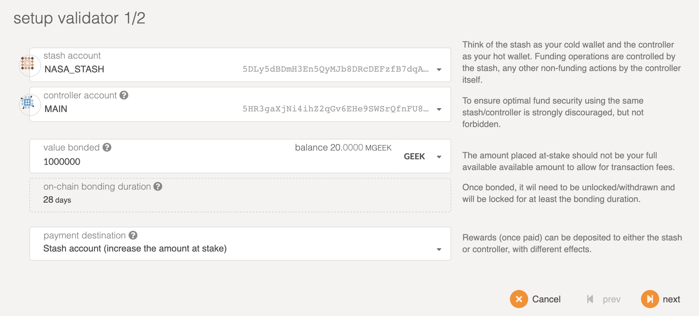
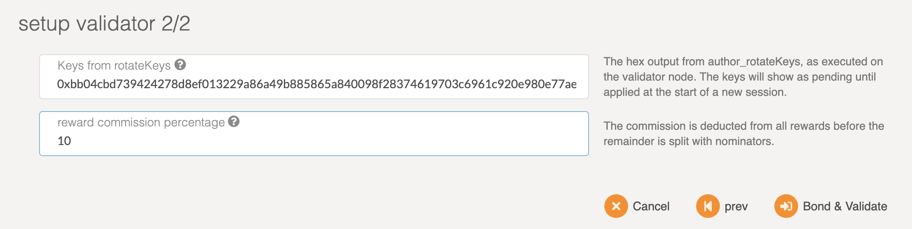

# How to run a Validator on GeekCash
Bash installer for GeekCash Validator on Ubuntu 18.04 LTS x64 and Ubuntu 20.04 LTS x64


### Standard requirements
OS: Ubuntu 18.04

CPU: >=4 core

RAM: >=8GB

HDD: 80GB - 160GB

### Login to your vps as root, download the `install.sh` file and then run it:
```
wget https://raw.githubusercontent.com/GeekCash/validator/master/install.sh
chmod +x ./install.sh
sudo bash ./install.sh
```

You can tail the logs with `journalctl` like so:
```
journalctl -f -u geek
```

### Setup validator


It is highly recommended that you make your controller and stash accounts be two separate accounts. For this, you will create two accounts and make sure each of them have at least enough funds to pay the fees for making transactions. Keep most of your funds in the stash account since it is meant to be the custodian of your staking funds.

Make sure not to bond all your GEEK balance since you will be unable to pay transaction fees from your bonded balance.

It is now time to set up our validator. We will do the following:

Bond the GEEK of the Stash account. These GEEK will be put at stake for the security of the network and can be slashed.
Select the Controller. This is the account that will decide when to start or stop validating.

First, go to the Staking section. Click on [Account Actions](https://my.geekcash.org/#/staking/actions), and then the **Validator** button.



**Stash account:** - Select your Stash account. In this example, we will bond 1M GEEK, make sure that your Stash account contains at least this much. You can, of course, stake more than this.

**Controller account:** - Select the Controller account created earlier. This account will also need a small amount of GEEK in order to start and stop validating.

**Value bonded:** - How much GEEK from the Stash account you want to bond/stake. Note that you do not need to bond all of the GEEK in that account. Also note that you can always bond more GEEK later. However, withdrawing any bonded amount requires the duration of the unbonding period. On GeekCash, the planned unbonding period is 28 days.

**Payment destination:** - The account where the rewards from validating are sent. If you'd like to redirect payments to an account that is neither the controller nor the stash account, set one up. Note that it is extremely unsafe to set an exchange address as the recipient of the staking rewards.

### Generating the Session Keys

Once your node is fully synced, stop the process by pressing Ctrl-C. At your terminal prompt, it is easier to run this command

```
curl -H "Content-Type: application/json" -d '{"id":1, "jsonrpc":"2.0", "method": "author_rotateKeys", "params":[]}' http://localhost:9933
```
The output will have a hex-encoded "result" field. The result is the concatenation of the four public keys. Save this result for a later step.

### Submitting the setKeys Transaction



**Reward commission:** You can specify the percentage of the rewards that will get paid to you. The remaining will be split among your nominators.

Click **"Bond & Validate"**.

The validator set is refreshed every era. In the next era, if there is a slot available and your node is selected to join the validator set, your node will become an active validator. Until then, it will remain in the waiting queue. If your validator is not selected to become part of the validator set, it will remain in the waiting queue until it is. There is no need to re-start if you are not selected for the validator set in a particular era. However, it may be necessary to increase the number of GEEK staked or seek out nominators for your validator in order to join the validator set.

**Congratulations!** If you have followed all of these steps, and been selected to be a part of the validator set, you are now running a GeekCash Validator! If you need help, reach out on the [GeekCash Validator chat](https://discord.gg/4fDKzQw).


### Suggest VPS

Get $100 bonus for new register: [Take it now](https://m.do.co/c/427fd48a9ec5)
then enter coupon code ($15): LowEndBox

Get $25 for new register: [Take it now](https://upcloud.com/signup/?promo=57GV2N)

Get $10 for new register: [Take it now](https://www.vultr.com/?ref=6838038)


More info: [GeekCash.org](https://geekcash.org) | [Discord](https://discord.gg/4fDKzQw)